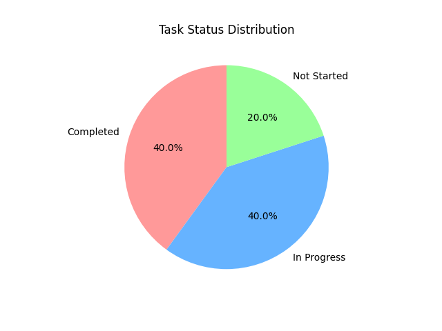

# Project Task Tracker

This project uses **Pandas** to manage and track project tasks, resources, and deadlines. It provides insights into task status, overdue tasks, remaining time, and team member workload.

## Features:
- Tracks tasks with details such as name, start date, end date, assigned resources, status, and priority.
- Displays task status summary (Completed, In Progress, Not Started).
- Identifies overdue tasks and calculates remaining days.
- Groups tasks by assigned team members and calculates their task load.
- Visualizes task status distribution with pie charts.

## Project Structure:
Project-Task-Tracker/ ├── project_task_tracker.py # Main Python script ├── README.md # Project documentation └── images/ # Folder containing output images └── project_task_tracker_result.png # Pie chart of task status distribution


## Steps:
1. **Load Task Data:** Define and load task details, including start date, end date, status, and assigned resource.
2. **Preprocess Data:** Convert date columns to datetime format and calculate overdue status.
3. **Task Analysis:** Calculate percentage of tasks completed, task status summary, and task distribution by team members.
4. **Remaining Days Calculation:** Calculate the remaining days for each task.
5. **Visualization:** Create a pie chart showing the distribution of task statuses.

## Output Visualizations:

### 1. Task Status Distribution
A pie chart representing the distribution of task statuses (Completed, In Progress, Not Started).



## Requirements:
- Python 3.x
- Libraries: pandas, matplotlib

## How to Run:
1. Clone the repository:
   ```bash
   git clone https://github.com/your-username/project-task-tracker.git

2. Navigate to the project directory:
   ```bash
   cd project-task-tracker

3. Install required libraries:
   ```bash
   pip install pandas matplotlib

4. Run the script:
   ```bash
    python project_task_tracker.py

License:

This project is open-source and available under the MIT License.


### Instructions:
- Copy this code into your `README.md` file in your GitHub repository.
- Replace the GitHub repository URL (`https://github.com/your-username/project-task-tracker.git`) with your actual URL.
- Ensure you have the `images` folder in your project directory to store the generated pie chart image.

This will help display a structured and clean README for your project on GitHub!
